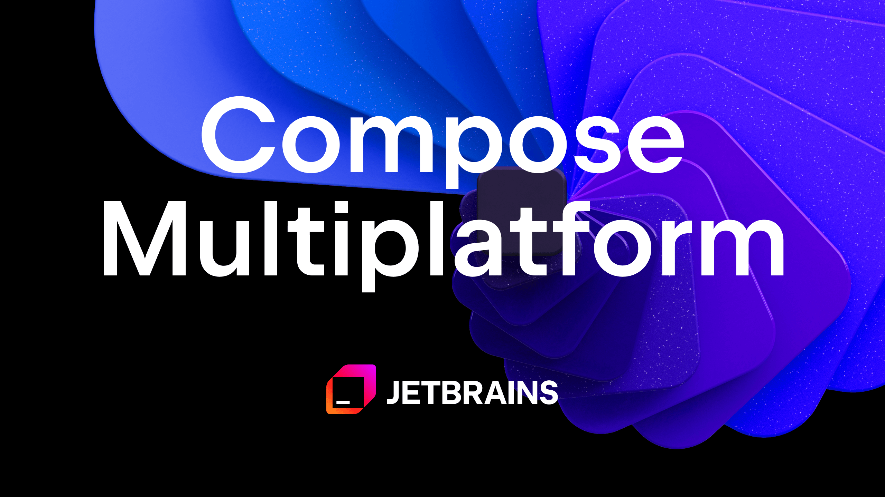

Compose Multiplatform 1.12.0-beta01 landed this morning. If you read the changelog top to bottom, the headline features come first: a mesh gradient painter and layer outsets. Both are good additions. Neither is the reason this release matters.

The reason is buried lower, in the iOS section, in two lines most people will scroll straight past.

So let me make the case for reading a changelog backwards.

## The two features that'll get screenshotted

`MeshGradientPainter` arrives in `Modifier.paint`. You hand it a grid of color points and let them blend into each other across a surface, which is the same richer-than-linear gradient style SwiftUI picked up in iOS 18. It's perfect for a splash screen or a marketing surface that needs to look less flat.

`LayerOutsets` is the more practical of the two. When a `graphicsLayer` gets promoted to an offscreen buffer, Compose clips whatever you draw to the layer's measured bounds. That's why a soft shadow or an outer glow sometimes gets sliced off at the edge. Layer outsets let you push the visual bounds past the measured size, so the shadow survives. If you've ever fought a clipped shadow, you know the exact annoyance this removes.

Useful, both of them. But quality-of-life features aren't what decide whether you'd bet a product on a framework. Fixes are.

## The line that actually matters

Here it is, straight from the iOS fixes:

> Fix swipe-back gesture conflict with horizontally scrollable components like HorizontalPager.

That one sentence is doing a lot of work. To see why, you have to understand the gesture it's about.

### Why a pager and the back gesture fight

iOS users navigate back by swiping in from the left edge of the screen. It's muscle memory, and an app that ignores it feels broken in a way users can't always put into words. Under the hood, that gesture is a `UIScreenEdgePanGestureRecognizer` living on `UINavigationController.interactivePopGestureRecognizer`.

Now drop a `HorizontalPager` onto that screen. A carousel, an onboarding flow, a row of swipeable tabs. The pager also wants horizontal drags. Near the left edge, both gestures land on the same touch, and the system has to choose one. Swipe to see the previous page and you might trigger a back navigation instead. Swipe to go back and the pager might swallow it. The result is a screen where the most basic iOS gesture randomly stops working.

This isn't really a Compose flaw. It's a UIKit gesture-arena problem, and every cross-platform toolkit runs straight into it. React Native shipped a fix in `react-native-pager-view` that calls `requireGestureRecognizerToFail` on the pager's scroll view when the pop gesture is present. Flutter has a long-standing issue open for the exact same edge-swipe-versus-scrollview collision. The native answer is gesture coordination: teach the recognizers how to defer to each other, usually by enabling the back swipe only when you're on the first page and dragging rightward. That is now what Compose handles for you.

### What we did before 1.12

For years, the workaround in Compose Multiplatform was to route around the problem. Reach for a third-party navigation library like Voyager or Decompose, or hand-roll a UIKit gesture controller in Swift and bolt it onto the Compose view. These worked, mostly, until they didn't. People reported their carefully built workaround dying after the upgrade to Compose 1.7, which is the special kind of pain you get from depending on undocumented behavior.

This is the friction that's kept Compose-on-iOS feeling almost native, but not quite. Read any honest 2026 assessment of the framework and you'll find a version of the same caveat: shared Compose UI "may feel more Android-like on iOS." Gesture fidelity is exactly where that gap shows. You never notice a good back swipe. You absolutely notice a broken one.

The same 1.12 cycle also fixes the content jump at the very start of the back swipe. On paper it's tiny. In practice it's the line between "it works" and "it feels right," and on iOS that line is the whole game.

## The quieter fix that's arguably bigger

The second change worth your attention:

> ViewModel now receives onCleared call when Compose Container is deallocated.

If you only write Android, this reads like nothing. If you ship Compose to iOS, this is the kind of fix that quietly stops a memory leak.

### What onCleared is for

On Android, a `ViewModel` gets a lifecycle for free. It's scoped to an Activity, a Fragment, or a navigation back-stack entry. When that scope ends, the framework calls `clear()`, which runs your `onCleared()` and then cancels `viewModelScope`. That cancellation is how your background work stops. The Flow collectors, the polling loops, the in-flight network calls all get torn down with the scope.

### Why iOS made it fragile

iOS has no Activity. The ViewModel's lifecycle has to ride on the Compose container, which is a `UIViewController` underneath. And there's a long, well-documented history of that container not deallocating cleanly on iOS: memory climbing, objects never released, `ComposeUIViewController` simply refusing to run `dealloc`. If the container never goes away, the store that owns your ViewModel never clears, `onCleared()` never fires, and `viewModelScope` never cancels.

Picture what that means at runtime. You navigate away from a screen. Its ViewModel is supposed to be finished. Instead a Flow it started is still collecting, a `while (isActive)` timer is still ticking, a socket is still open. Nothing crashes. Memory just creeps up the longer the session runs. It's the worst class of bug, because it stays invisible until it isn't.

This is the reason so many teams reached for moko-mvvm, Rick Clephas's KMP-ObservableViewModel, resaca, or Touchlab's KaMPKit in the first place. They wanted a `clear()` they could trust on iOS.

1.12 tightens the native path. When the Compose container is deallocated, your ViewModel gets `onCleared`, and the cleanup you already wrote finally runs. It's unglamorous plumbing. It's also the plumbing that decides whether a long-lived app leaks.

## Read the fix list, not the feature list

Here's the real point, and it's bigger than one release.

When you're deciding whether to bet on a cross-platform UI framework, the feature list is marketing. What the team chooses to fix is the honest map of where the framework still hurts, and how fast that's changing.

Look at the arc. Compose Multiplatform for iOS went stable in 1.8 back in May 2025. 1.9 added native IME and text-input customization on iOS. 1.10 unified the `@Preview` annotation and brought Navigation 3 to non-Android targets. 1.11 was, in JetBrains' own words, improvements to the iOS and web experience. 1.12 is gestures and lifecycle. That's not a team chasing screenshots. That's a team grinding on the "feels native" gap, release after release: scroll physics, text selection, IME, gestures, lifecycle. The boring stuff. The stuff that decides whether your app belongs on the platform.

The market is reading it the same way. KMP usage among professional developers doubled in a single year, from 7% in 2024 to 18% in 2025. Netflix, McDonald's, Cash App, and Forbes run it in production. The mesh gradients get the blog headlines. The gesture fixes get the adoption.

## Before you bump the version

A few honest caveats, because this is a beta and beta means beta.

This is `1.12.0-beta01`. The 1.11 line is still your production target. Don't ship this one to the App Store.

The `NativeCanvas` and `NativePaint` typealiases are now ERROR-level deprecated, not warnings. If you ever touched the native graphics interop, this upgrade breaks your build until you migrate off them.

Material3 rides its own version train and sits on a separate alpha at the time of this beta, so don't assume the whole stack moves in lockstep. Check your component versions before you trust the bump.

Treat this build as a preview of what 1.12 stable will bring: an iOS experience that's quietly, materially better than it was a release ago.

## The takeaway

A flashy feature wins the release notes. A fixed gesture keeps the user who almost uninstalled.

So next time a framework you depend on ships a release, skip the headline. Scroll past the new features and read what the team fixed. That list tells you something the marketing never will, which is whether they're building a demo or building a product.

---

### Further reading

- Compose Multiplatform 1.12.0-beta01 release notes: https://github.com/JetBrains/compose-multiplatform/releases
- Navigation and the iOS back gesture (Kotlin docs): https://kotlinlang.org/docs/multiplatform/compose-navigation.html
- ViewModel in Compose Multiplatform (Kotlin docs): https://kotlinlang.org/docs/multiplatform/compose-viewmodel.html
- The long-running ComposeUIViewController dealloc issue: https://github.com/JetBrains/compose-multiplatform/issues/3361
- The same gesture conflict in React Native pager-view: https://github.com/callstack/react-native-pager-view/pull/500
- Kotlin Multiplatform production case studies: https://kotlinlang.org/case-studies/
